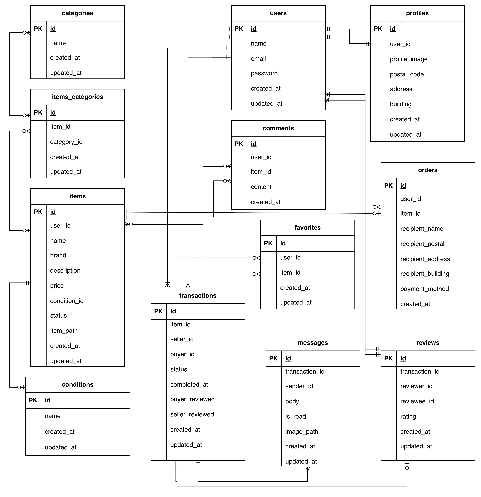

# Flema アプリケーション

本リポジトリは **Docker + Laravel 8 + MySQL + Stripe + Fortify** を用いた  
フリマアプリ「Flema」の開発環境および実装内容をまとめたものです。

本 README では、以下について説明します。

- アプリの概要および追加機能
- ローカル開発環境の構築手順
- メール認証・決済機能の確認方法
- テスト環境に関する注意点

---
## アプリ概要

Flema は、会員登録・商品出品・購入・取引・評価までを一貫して行える  
フリマアプリです。

ユーザーは以下の操作を行うことができます。

- 会員登録・ログイン（メール認証対応）
- 商品の出品・閲覧・検索・購入
- いいね・コメントによる商品コミュニケーション
- 購入後の取引管理（取引一覧・チャット）
- 相互評価による取引完了


## 今回の追加機能（概要）

- 商品購入後の遷移を「商品一覧 → 取引一覧」へ変更
- 評価完了後に商品一覧画面へ遷移
- 取引中の商品の表示、メッセージ表示
- 取引画面の追加、出品者・購入者の評価機能追加
- 取引チャット機能の追加（画像送信対応）
- 相互評価が完了した時点で取引完了とする仕様
- 取引完了時に出品者へメール通知を送信

**詳細は下で説明します**

---

## 1. リポジトリのクローン

```bash
git clone git@github.com:ando625/fleamaapp.git
cd fleamaapp
```

---

## 2. Docker 環境起動

Docker Desktop を起動後、以下を実行：

```bash
docker compose up -d --build
```

コンテナの確認：

```bash
docker compose ps
```

`docker-compose.yml` にすでに MailHog が定義されています。  
そのため、以下のコマンドで MailHog も自動で立ち上がります。

```
php         Up
mysql       Up
phpmyadmin  Up
mailhog     Up
```


---

## 3. Laravel 環境構築

### 3-1. PHP コンテナに入る

```bash
docker compose exec php bash
```

### 3-2. Composer で依存関係をインストール

```bash
composer install
```

- Fortify もこのときに自動でインストールされます。手動で入れる必要はありません。


### 3-3. `.env` ファイル作成

```bash
cp .env.example .env
```

.env に以下を設定：

```
DB_CONNECTION=mysql
DB_HOST=mysql
DB_PORT=3306
DB_DATABASE=laravel_db
DB_USERNAME=laravel_user
DB_PASSWORD=laravel_pass
```


## メール認証機能（MailHog使用）

- 本アプリでは 新規会員登録時および初回ログイン時にメール認証 を行います。
- メール送信のテストは MailHog を使用します。


### 確認 ブラウザで MailHog の管理画面にアクセス

- http://localhost:8025

1. SMTPサーバー: localhost:1025
2. Web UI: http://localhost:8025 → 送信された認証メールを確認可能


### Laravel 側の設定（.env）

```
MAIL_MAILER=smtp
MAIL_HOST=mailhog
MAIL_PORT=1025
MAIL_USERNAME=null
MAIL_PASSWORD=null
MAIL_ENCRYPTION=null
MAIL_FROM_ADDRESS="example@furiapp.test"
MAIL_FROM_NAME="${APP_NAME}"
```

- 新規登録後、誘導画面の「認証はこちらから」ボタンを押すと押すと MailHog が開き、届いたメール内のリンクをクリックして認証を完了させる、そしてプロフィール画面へ遷移します。
- 新規登録後メール認証をせずにログインした場合、メール認証画面に飛びます、そしてプロフィール登録していただきます。

### メール認証の流れ

1.	新規ユーザーを登録（メールアドレス・パスワードを入力）
2.	登録完了後、メール認証誘導画面に遷移
3.	誘導画面で「認証はこちらから」ボタンをクリックすると、MailHog が開きます。
4.	MailHog で届いた認証メールの中の「メールアドレスはこちら」or 「Verify Email Address」リンク（ボタン）をクリックして初めてメール認証が完了し、プロフィール設定画面に遷移します。
5. 認証完了 → プロフィール設定画面に遷移


### 3-4. アプリケーションキー生成

```bash
php artisan key:generate
```

### 3-5. データベース準備（データベースの初期化・開発用）

開発環境で事前にダミーデータを入れるので以下を実行してください：

```bash
php artisan migrate:fresh --seed
```

### 3-6. ストレージリンク作成

```bash
php artisan storage:link
```


---

## テスト用データベースの準備

### ⚠️ 注意
本番データベースをテストで使うのは非常に危険です。
安全にテストを実行するために、**テスト専用データベース（`demo_test`）** を作成します。


### ⚠️ 追加機能後テストについて（概要）

Seeder構成変更により、一部既存テストが失敗する可能性があります。
詳細は下部「追加機能に関する注意事項（テスト）」を参照してください。
---

<details>
<summary>テスト用データベースの詳細設定手順（クリックして展開）</summary>
### MySQLコンテナに入る

まず MySQL コンテナに接続します。
mysqlにcdで移動して↓

```bash
docker compose exec mysql bash
```

---

### MySQL に root ユーザーでログイン

```bash
mysql -u root -p
```

パスワードは `docker-compose.yml` の中にある

```yaml
MYSQL_ROOT_PASSWORD: root
```

で設定した `root` を入力します。

---

### テスト用データベースを作成

MySQL にログインできたら、以下を実行：

```sql
CREATE DATABASE demo_test;
SHOW DATABASES;
```

`demo_test` が一覧に表示されればOKです

---

### database.php の設定確認

`config/database.php` に以下のような **「mysql_test」設定** が追加されていることを確認してください。

（このプロジェクトではすでに設定済みです。追記する必要はありません）

```php
'mysql_test' => [
    'driver' => 'mysql',
    'url' => env('DATABASE_URL'),
    'host' => env('DB_HOST', '127.0.0.1'),
    'port' => env('DB_PORT', '3306'),
    'database' => 'demo_test',
    'username' => 'root',
    'password' => 'root',
    'unix_socket' => env('DB_SOCKET', ''),
    'charset' => 'utf8mb4',
    'collation' => 'utf8mb4_unicode_ci',
    'prefix' => '',
    'prefix_indexes' => true,
    'strict' => true,
    'engine' => null,
],
```


その後退出
```
exit
```
---

### `.env.testing` の作成

cdでphpに移動し、
PHP コンテナに入って、`.env` をコピーして `.env.testing` を作成します。

```bash
docker compose exec php bash
cp .env .env.testing
```

`.env.testing` を開いて、上部とDB接続部分を以下のように編集します。

```dotenv
APP_NAME=Laravel
APP_ENV=test
APP_KEY=
APP_DEBUG=true
APP_URL=http://localhost

DB_CONNECTION=mysql_test
DB_HOST=mysql
DB_PORT=3306
DB_DATABASE=demo_test
DB_USERNAME=root
DB_PASSWORD=root
```

✅ `APP_ENV` は `test` に変更


✅ `APP_KEY` は一旦空欄にしておきます


✅ `DB` も`demo_test`と`roo`に設定します

---

### テスト用アプリキーを生成
そして、先ほど「空」にしたAPP_KEYに新たなテスト用のアプリケーションキーを加えるために以下のコマンドを実行します

```bash
php artisan key:generate --env=testing
```

その後、キャッシュをクリアして反映：

```bash
php artisan config:clear
```

---

### テスト用マイグレーション実行

```bash
php artisan migrate --env=testing
```

これで `demo_test` にテーブルが作成されます


---

### PHPUnit の設定確認

このプロジェクトには、すでに **テスト環境用の設定済み `phpunit.xml`** が用意されています。
特に編集は不要です。内容を確認して、下記のように設定されていることを確認してください。

```xml
<php>
    <server name="APP_ENV" value="testing"/>
    <server name="BCRYPT_ROUNDS" value="4"/>
    <server name="CACHE_DRIVER" value="array"/>
    <server name="DB_CONNECTION" value="mysql_test"/>
    <server name="DB_DATABASE" value="demo_test"/>
    <server name="MAIL_MAILER" value="array"/>
    <server name="QUEUE_CONNECTION" value="sync"/>
    <server name="SESSION_DRIVER" value="array"/>
    <server name="TELESCOPE_ENABLED" value="false"/>
</php>
```

✅ `DB_CONNECTION="mysql_test"`
✅ `DB_DATABASE="demo_test"`


 この設定により、テスト実行時は  
- 環境：`testing`  
- 接続先DB：`mysql_test`  
- 使用DB名：`demo_test`  
が自動的に選ばれます。

---

### 設定確認コマンド

もし設定が正しく反映されているか不安な場合は、  
以下のコマンドで `.env.testing` と `phpunit.xml` の内容を確認できます。

```bash
docker compose exec php bash
cat .env.testing | grep DB_
grep DB_ phpunit.xml
```

結果が以下のようになっていればOKです

```
DB_CONNECTION=mysql_test
DB_DATABASE=demo_test
```
---

### これでテスト用DB環境の準備完了！

今後は以下のコマンドでテストを実行できます。

```bash
php artisan test
```


</details>

---

## 5. Stripe のセットアップ

PHPコマンドの中に入り実行:
```bash
composer require stripe/stripe-php
```

.env に Stripe の公開キー・秘密キーを設定

```
STRIPE_KEY=pk_test_xxxxxxxxx
STRIPE_SECRET=sk_test_xxxxxxx
```
GitHubのセキュリティのでAPIキーは載せられないのでご自身でStripeにログインし、
コピーして貼り付けて設定してください。
**Stripe キーは Stripe にログインしダッシュボードで取得します。**


##  Stripe 設定ファイルについて

・StripeのAPIキーは .env ファイルに保存したあと、config/services.php から呼び出すように設定しています。


・以下の設定が存在することを確認してください。

```
// config/services.php
'stripe' => [
    'key' => env('STRIPE_KEY'),
    'secret' => env('STRIPE_SECRET'),
],
```

この設定により、コントローラ内で以下のようにStripeを利用できます。

```php
\Stripe\Stripe::setApiKey(config('services.stripe.secret'));
```

- カード払いは Stripe Checkout を利用
- コンビニ払いは Stripe を通さず DB に即保存し、トップページにリダイレクト


## 💳 Stripe 決済テストについて

このアプリでは Stripe を使用して決済テストを行います。
テストモード中は以下のカード番号を使用してください。

| テスト内容 | カード番号 | 結果 |
|-------------|-------------|------|
| 通常の成功決済 | 4242 4242 4242 4242 | 成功 |
| 失敗テスト（残高不足） | 4000 0000 0000 9995 | 決済失敗になります |

- 有効期限：任意（例: 12/34）  
- セキュリティコード：任意（例: 123）  
- 郵便番号：任意（例: 12345）

詳細は [Stripe公式ドキュメント](https://stripe.com/docs/testing) をご参照ください。

---

## 6. 購入処理の流れ

### カード払いの場合

1. 商品購入画面で「カード支払い」を選択
2. `PurchaseController@checkout` が Stripe Checkout セッションを作成
3. Stripe 画面にリダイレクト
4. 支払い成功後、`PurchaseController@complete` で DB 保存・商品ステータス更新

### コンビニ払いの場合

1. 商品購入画面で「コンビニ払い」を選択
2. `PurchaseController@checkout` で即 DB 保存・商品ステータス更新
3. トップページにリダイレクト
4. Stripe 画面はスキップされる (Stripe実行はなし)


### 購入バリデーションに関して注意（PurchaseRequest.php)

- 配送先（住所）は、ユーザー登録時に必ず入力され、さらに購入画面の「変更する」リンクからも必ず確認・変更できるため、PurchaseRequest では住所のバリデーションを設定していません。
**そのため、購入フォームで必須入力となるのは支払い方法のみです。**

---
## トラブルシューティング（MailHogエラー）

他プロジェクトでMailHogコンテナが残っている場合、以下のようなエラーが出ることがあります。
その場合は、既存のMailHogを削除してから再度起動してください。

```bash
docker rm -f mailhog
docker compose up -d --build
```

---

## ７. phpMyAdmin

- URL: `http://localhost:8080/`
- ユーザー名・パスワードは `.env` と同じ
- DB: `laravel_db` を確認可能

---

## 8. 注意事項

- MySQL データは `.gitignore` により Git には含めない
- Mac M1/M2 ARM 環境では MySQL と phpMyAdmin に `platform: linux/amd64` が指定済み
- PHP 8.1 以降、`mbstring.internal_encoding` は廃止されているため、警告が出たらコメントアウト

---

## 9. テストユーザー

## ダミーデータについて

本アプリケーションでは、動作確認および画面表示確認のために
ユーザーおよび商品のダミーデータを用意しています。

### ユーザーダミーデータ

以下のユーザーを `UserSeeder` にて作成しています。
**ログイン前に確認してからログインしてください**

| ユーザー名 | メールアドレス |
|-----------|----------------|
| ユーザー1 | test1@example.com |
| ユーザー2 | test2@example.com |
| ユーザー3 | test3@example.com |

- 全ユーザー共通のパスワード：`pass1234`
- メール認証済み状態で作成されています
- 各ユーザーには `profiles` テーブルに紐づくプロフィール情報が自動で作成されます

#### プロフィール初期値

- 郵便番号：123-4567  
- 住所：東京都渋谷区  
- 建物名：明マンション123  

---

### 商品ダミーデータ

以下の商品データを用意しています。

| 商品ID | 商品名 | 価格 | 出品ユーザー |
|------|------|------|------------|
| CO01 | 腕時計 | 15,000円 | test1 |
| CO02 | HDD | 5,000円 | test1 |
| CO03 | 玉ねぎ3束 | 300円 | test1 |
| CO04 | 革靴 | 4,000円 | test1 |
| CO05 | ノートPC | 45,000円 | test1 |
| CO06 | マイク | 8,000円 | test2 |
| CO07 | ショルダーバッグ | 3,500円 | test2 |
| CO08 | タンブラー | 500円 | test2 |
| CO09 | コーヒーミル | 4,000円 | test2 |
| CO10 | メイクセット | 2,500円 | test2 |

- 商品1〜5は **ユーザー1** が出品
- 商品6〜10は **ユーザー2** が出品
- 各商品には画像URL、商品説明、コンディションが設定されています

---

### シーディング実行方法

以下のコマンドでダミーデータを投入できます。

```bash
php artisan migrate:fresh --seed 
```

- ログインはこちらから http://localhost/login


---
## 10.テーブル

### usersテーブル

| カラム名 | 型 | PK | UNIQUE | NOT NULL | FK |
|---|---|---|---|---|---|
| id | unsigned bigint | ○ |  | ○ |  |
| name | string |  |  | ○ |  |
| email | string |  | ○ | ○ |  |
| password | string |  |  | ○ |  |
| created_at | timestamp |  |  | ○ |  |
| updated_at | timestamp |  |  | ○ |  |


### profilesテーブル

| カラム名 | 型 | PK | UNIQUE | NOT NULL | FK |
|---|---|---|---|---|---|
| id | unsigned bigint | ○ |  | ○ |  |
| user_id | unsigned bigint |  | ○ | ○ | users(id) |
| profile_image | string |  |  |  |  |
| postal_code | string |  |  | ○ |  |
| address | string |  |  | ○ |  |
| building | string |  |  |  |  |
| created_at | timestamp |  |  | ○ |  |
| updated_at | timestamp |  |  | ○ |  |


### categoriesテーブル

| カラム名 | 型 | PK | UNIQUE | NOT NULL | FK |
|---|---|---|---|---|---|
| id | unsigned bigint | ○ |  | ○ |  |
| name | string |  |  | ○ |  |
| created_at | timestamp |  |  | ○ |  |
| updated_at | timestamp |  |  | ○ |  |

### itemsテーブル

| カラム名 | 型 | PK | UNIQUE | NOT NULL | FK |
|---|---|---|---|---|---|
| id | unsigned bigint | ○ |  | ○ |  |
| user_id | unsigned bigint |  |  | ○ | users(id) |
| name | string |  |  | ○ |  |
| brand | string |  |  |  |  |
| description | string |  |  | ○ |  |
| price | text |  |  | ○ |  |
| condition_id | unsigned bigint |  |  | ○ | conditions(id) |
| status | string |  |  | ○ |  |
| item_path | string |  |  | ○ |  |
| created_at | timestamp |  |  | ○ |  |
| updated_at | timestamp |  |  | ○ |  |

### commentsテーブル

| カラム名 | 型 | PK | UNIQUE | NOT NULL | FK |
|---|---|---|---|---|---|
| id | unsigned bigint | ○ |  | ○ |  |
| user_id | unsigned bigint |  |  | ○ | users(id) |
| item_id | unsigned bigint |  |  | ○ | items(id) |
| content | text |  |  | ○ |  |
| created_at | timestamp |  |  | ○ |  |
| updated_at | timestamp |  |  | ○ |  |

### favoritesテーブル

| カラム名 | 型 | PK | UNIQUE | NOT NULL | FK |
|---|---|---|---|---|---|
| id | unsigned bigint | ○ |  | ○ |  |
| user_id | unsigned bigint |  |  | ○ | users(id) |
| item_id | unsigned bigint |  |  | ○ | items(id) |
| created_at | timestamp |  |  | ○ |  |
| updated_at | timestamp |  |  | ○ |  |

### ordersテーブル

| カラム名 | 型 | PK | UNIQUE | NOT NULL | FK |
|---|---|---|---|---|---|
| id | unsigned bigint | ○ |  | ○ |  |
| user_id | unsigned bigint |  |  | ○ | users(id) |
| item_id | unsigned bigint |  |  | ○ | items(id) |
| recipient_name | string |  |  | ○ |  |
| recipient_postal | string |  |  | ○ |  |
| recipient_address | string |  |  | ○ |  |
| recipient_building | string |  |  |  |  |
| payment_method | string |  |  | ○ |  |
| created_at | timestamp |  |  | ○ |  |
| updated_at | timestamp |  |  | ○ |  |

### items_categoriesテーブル

| カラム名 | 型 | PK | UNIQUE | NOT NULL | FK |
|---|---|---|---|---|---|
| id | unsigned bigint | ○ |  | ○ |  |
| item_id | unsigned bigint |  |  | ○ | items(id) |
| category_id | unsigned bigint |  |  | ○ | categories(id) |
| created_at | timestamp |  |  | ○ |  |
| updated_at | timestamp |  |  | ○ |  |

### conditionsテーブル

| カラム名 | 型 | PK | UNIQUE | NOT NULL | FK |
|---|---|---|---|---|---|
| id | unsigned bigint | ○ |  | ○ |  |
| name | string |  |  | ○ |  |
| created_at | timestamp |  |  | ○ |  |
| updated_at | timestamp |  |  | ○ |  |


### transactions テーブル

| カラム名 | 型 | PK | UNIQUE | NOT NULL | FK |
|---|---|---|---|---|---|
| id | unsigned bigint | ○ |  | ○ |  |
| item_id | unsigned bigint |  |  | ○ | items(id) |
| buyer_id | unsigned bigint |  |  | ○ | users(id) |
| seller_id | unsigned bigint |  |  | ○ | users(id) |
| status | string |  |  | ○ |  |
| completed_at | timestamp |  |  |  |  |
| buyer_reviewed | boolean |  |  | ○ |  |
| seller_reviewed | boolean |  |  | ○ |  |
| created_at | timestamp |  |  | ○ |  |
| updated_at | timestamp |  |  | ○ |  |


### messages テーブル

| カラム名 | 型 | PK | UNIQUE | NOT NULL | FK |
|---|---|---|---|---|---|
| id | unsigned bigint | ○ |  | ○ |  |
| transaction_id | unsigned bigint |  |  | ○ | transactions(id) |
| sender_id | unsigned bigint |  |  | ○ | users(id) |
| body | text |  |  | ○ |  |
| image_path | string |  |  |  |  |
| is_read | boolean |  |  | ○ |  |
| created_at | timestamp |  |  | ○ |  |
| updated_at | timestamp |  |  | ○ |  |


### reviewsテーブル

| カラム名 | 型 | PK | UNIQUE | NOT NULL | FK |
|---|---|---|---|---|---|
| id | unsigned bigint | ○ |  | ○ |  |
| transaction_id | unsigned bigint |  | ○ | ○ | transactions(id) |
| reviewer_id | unsigned bigint |  |  | ○ | users(id) |
| reviewee_id | unsigned bigint |  |  | ○ | users(id) |
| rating | integer |  |  | ○ |  |
| created_at | timestamp |  |  | ○ |  |
| updated_at | timestamp |  |  | ○ |  |


---
## 追加機能概要

本機能追加では、**取引完了までの導線改善** および  
**取引チャット機能の拡張** を行いました。

### 画面遷移の変更点

| 変更前 | 変更後 |
|------|------|
| 商品購入後 → 商品一覧画面 | 商品購入後 → 取引一覧画面 → 相互評価完了 → 商品一覧画面 |

購入後すぐに取引一覧画面へ遷移させることで、  
購入者・出品者双方が **スムーズに取引・評価へ進める導線** に変更しています。

---

## 取引完了の仕様

本アプリでは、取引は  
**購入者・出品者の双方が評価を完了した時点で取引完了** となります。

### 取引完了までの流れ

1. 購入者が取引チャット画面で「取引を完了する」をクリック
2. 購入者が出品者を評価
3. 出品者が取引チャット画面を開き、購入者を評価
4. **購入者・出品者の両者が評価を完了した時点で取引完了**

### 仕様の意図

片方のみの評価では取引を完了とせず、  
**相互評価による合意をもって取引完了とする** ことで、  
一方的な取引終了を防ぐ仕様としています。

---

## 取引完了時のメール通知（MailHog）

商品購入者が取引を完了し、評価を送信すると、  
**出品者宛に取引完了通知メールが自動送信** されます。

- 本機能は **バックエンド側でのメール送信処理のみを実装**
- アプリケーション画面上からメール内容を確認する導線は設けていません

これは、実運用ではユーザーが  
Gmail 等の **外部メールクライアントで確認する想定** のためです。

### 開発環境での確認方法（MailHog）

ローカル開発環境では MailHog を使用して、  
送信されたメールを確認できます。

以下の URL にアクセスすることで、  
送信されたメール一覧および本文を確認できます。

- http://localhost:8025

---

## 取引サイドバー仕様

取引チャット画面左側には、**進行中の取引のみ** を表示するサイドバーを設置しています。

- 完了していない取引のみを一覧表示
- 新着メッセージ順で並び替え
- 商品名をクリックすると該当取引のチャット画面へ遷移
- 最新メッセージ順で表示されるため、返信が必要な取引を即座に確認可能

---

## メッセージ表示・入力仕様

### メッセージ吹き出し表示

- メッセージの内容量に応じてサイズが自動調整
- 短いメッセージ：内容に合わせた最小サイズで表示
- 長いメッセージ：改行され、縦方向に伸縮
- 自分のメッセージは右側、相手のメッセージは左側に表示

### メッセージ表示エリア

- 吹き出しは文字量に応じて自動で幅を調整
- 長文メッセージは縦スクロール可能

### メッセージ入力フォーム

- 入力内容に応じて高さが自動調整
- 入力フォームは画面下部に固定表示
- ページ遷移後も入力内容を保持

#### メッセージ入力保持機能（取引ごと）

- ブラウザの `localStorage` を利用し、取引IDごとに入力内容を保存
- ページ読み込み時、保存されていれば自動で入力欄に反映
- メッセージ送信時、対応する取引の保存内容は削除されます

**例**

- 取引「コーヒーミル」の入力内容  
- 取引「バッグ」の入力内容  

それぞれ別々に保持されます。

---

## ⚠️ 追加機能に関する注意事項（テスト）

### テストについて

本機能追加では、単体テストの新規実装は行っていません。

過去に作成した単体テストは存在しますが、  
今回の開発において **Seeder 構成を変更したため、  
一部テストが失敗する可能性があります。**

### テスト失敗の主な理由

- ユーザーSeederおよび商品Seederの内容を変更した
- テスト内で特定のユーザーID・商品IDを前提とした記述が存在する
- テスト作成当時とデータ構造が異なっている

### 補足

本課題では単体テストの実装は必須要件ではないため、  
今回はテストコードの修正は行っていません。

既存テストについては、  
Seeder に依存しないデータ生成（Factory 等）に修正することで  
対応可能な状態です。

---
## 11. ED図



---

## 12. 使用技術

- PHP 8.1.34
- Laravel 8.83.8
- MySQL 8.0.26
- MailHog
- Laravel Fortify
- PHPUnit
- GitHub
---

---

## 13. 開発環境 URL

- 開発環境: http://localhost/
- phpMyAdmin: http://localhost:8080/

---
